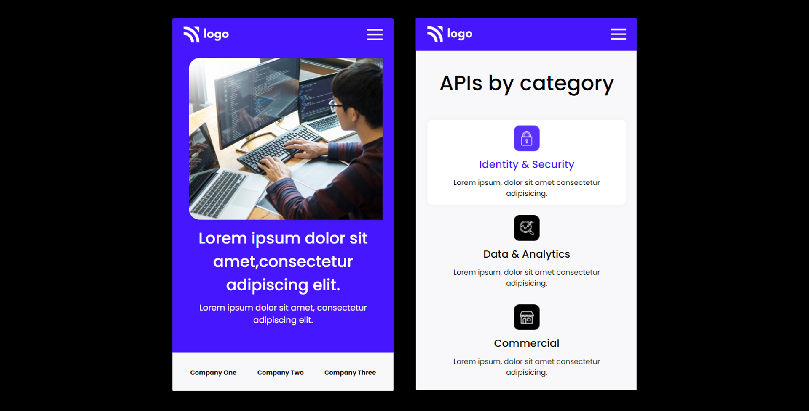

# Developer Landing Page

## [Live Site](https://developer-landing-webpage.netlify.app/)

## Introduction

This is a code repository for the fully responsive Developer Landing Page.

## Time taken to finish this project

It took me about 6 hours to complete this project.

## What I learned from this Project?

- Learnd to use css media queries.
- Learnd to use css position property.
- Learnd to use css flex-box.

